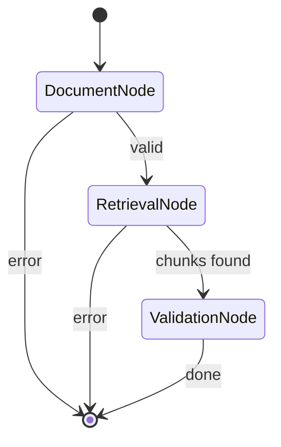

<div align="center">

# ClauseGuard

**AI-Powered Contract Risk Scanner**

A privacy-first, retrieval-driven AI system that detects risky clauses in contracts — with zero hallucinated citations.


</div>

---

## Overview

ClauseGuard is an AI-assisted contract risk detection system that:

- **Identifies** predefined high-risk clause categories in uploaded PDF contracts
- **Provides** grounded explanations backed by exact clause text
- **References** precise page numbers from the source document
- **Prevents** hallucinated legal analysis through retrieval-first validation

> **ClauseGuard is a structured risk-flagging assistant.** It is not a legal advisory tool, contract drafting system, or autonomous decision engine.

---

## Design Principles

| Principle | Description |
|---|---|
| **Retrieval-First Validation** | LLM only validates retrieved chunks — no open-ended scanning |
| **Deterministic Risk Categories** | Predefined categories with strict definitions and disambiguation rules |
| **Source-Grounded Outputs** | Every finding references exact clause text and page number |
| **Human-in-the-Loop** | Results are flagged for review, not acted upon autonomously |
| **Privacy-by-Design** | All processing is local; no external API calls or document persistence |

---

## System Architecture


### PDF Extraction Pipeline

Text extraction uses a multi-layer fallback strategy:

1. **pdfminer.six** — primary extractor
2. **PyPDF2** — fallback for simpler PDFs
3. **OCR (pytesseract + pypdfium2)** — fallback for scanned documents

---

## LangGraph Agent Pipeline

The analysis pipeline is built as a **LangGraph StateGraph** with conditional error edges:



| Node | Responsibility |
|---|---|
| **DocumentNode** | Validates `doc_id` exists in the vector store |
| **RetrievalNode** | Embeds user query + category seed queries; retrieves and deduplicates top-K chunks |
| **ValidationNode** | Runs LLM validation per chunk × category; filters by confidence threshold |

State flows through a shared `AgentState` (TypedDict). Any node can set `error` to halt the pipeline early.

---

## Risk Categories

| Key | Category | Description |
|---|---|---|
| `UNLIMITED_LIABILITY` | Unlimited Liability | Clauses imposing liability without a clear cap or limitation on damages |
| `INDEMNIFICATION` | Indemnification | Obligation to indemnify for broad categories of losses or third-party claims |
| `TERMINATION` | Termination for Convenience | Unilateral termination without cause, short notice, or without compensation |

Each category includes:
- **Definition** — strict criteria with disambiguation rules
- **Seed query** — used for category-aware retrieval augmentation

---

## Tech Stack

| Layer | Technology |
|---|---|
| **Backend** | Python 3.11, FastAPI, Pydantic v2, LangGraph |
| **LLM Inference** | Ollama (self-hosted), Llama 3 8B |
| **Embeddings** | BGE-Large via Ollama |
| **Vector Store** | In-memory cosine similarity with JSON persistence |
| **PDF Extraction** | pdfminer.six, PyPDF2, pytesseract (OCR) |
| **Frontend** | Next.js 14, TypeScript, TailwindCSS |
| **Infrastructure** | Docker Compose (backend, frontend, Ollama) |

---

## Project Structure

```
clauseguard/
├── backend/
│   ├── app/
│   │   ├── agents/                # LangGraph pipeline
│   │   │   ├── state.py           # AgentState TypedDict
│   │   │   ├── document_agent.py  # Document validation node
│   │   │   ├── retrieval_agent.py # Embedding + vector search node
│   │   │   ├── validation_agent.py# LLM validation node
│   │   │   └── orchestrator.py    # StateGraph builder + run_pipeline()
│   │   ├── api/
│   │   │   └── routes/
│   │   │       ├── analyze.py     # /analyze endpoint
│   │   │       ├── upload.py      # /upload endpoint
│   │   │       └── health.py      # /health endpoint
│   │   ├── services/
│   │   │   ├── llm/
│   │   │   │   ├── base.py        # Abstract LLM provider
│   │   │   │   ├── ollama_provider.py
│   │   │   │   └── types.py       # Validation prompt builder
│   │   │   ├── embedding_service.py
│   │   │   ├── vector_store.py    # In-memory + JSON persistence
│   │   │   ├── pdf_extraction.py  # Multi-fallback PDF extraction
│   │   │   ├── chunking.py        # Page-aware text chunking
│   │   │   └── risk_registry.py   # Category definitions + seed queries
│   │   ├── models/
│   │   │   └── risk_models.py     # RiskValidationResult schema
│   │   ├── config.py              # Pydantic settings
│   │   └── main.py                # FastAPI app factory
│   ├── tests/
│   ├── Dockerfile
│   └── requirements.txt
├── frontend/
│   ├── app/
│   │   └── analyze/page.tsx       # Upload + analyze UI
│   ├── components/
│   │   ├── UploadDropzone.tsx
│   │   ├── RiskDashboard.tsx
│   │   ├── RiskCard.tsx
│   │   └── ConfidenceBadge.tsx
│   ├── Dockerfile
│   └── package.json
├── infra/
│   ├── docker-compose.yml
│   ├── nginx.conf
│   └── terraform/                 # AWS ECS deployment (scaffold)
└── README.md
```

---

## Quick Start

### Prerequisites

- **Docker** and **Docker Compose**
- **16 GB RAM** recommended (Ollama + LLM model)

### 1. Clone the repository

```bash
git clone https://github.com/bahraminekoo/clauseguard.git
cd clauseguard
```

### 2. Start all services

```bash
docker compose -f infra/docker-compose.yml up -d
```

### 3. Pull the required models into Ollama

```bash
docker compose -f infra/docker-compose.yml exec ollama ollama pull llama3
docker compose -f infra/docker-compose.yml exec ollama ollama pull bge-large
```

### 4. Open the dashboard

```
http://localhost:3000
```

---

## API Endpoints

| Method | Endpoint | Description |
|---|---|---|
| `POST` | `/upload` | Upload a PDF contract; returns `doc_id` |
| `POST` | `/analyze` | Analyze a document by `doc_id` + `query_text`, or raw `text` |
| `GET` | `/health` | Health check |

---

## Example Output

```json
{
  "findings": [
    {
      "category": "Termination for Convenience",
      "confidence": 0.92,
      "page": 3,
      "explanation": "The Employer may terminate at any time for sole convenience, with or without cause.",
      "clause_text": "The Employer shall have the right to terminate this Agreement at any time for its sole convenience..."
    }
  ]
}
```

---

## Provider Abstraction

ClauseGuard separates orchestration from model implementation:

- **LLM Provider** — abstract `LLMProvider` base class; current implementation: `OllamaLLMProvider`
- **Embedding Provider** — abstract `EmbeddingProvider` base class; current implementation: `OllamaEmbeddingProvider`

Swap providers by implementing the base class — no changes to agents or routes required.

---

## Testing

```bash
docker compose -f infra/docker-compose.yml exec backend pytest tests/ -v
```

- **Validation output tests** — deterministic JSON schema checks
- **Retry/fallback tests** — LLM provider handles malformed responses
- **Chunking tests** — page-aware segmentation
- **API endpoint tests** — upload and analyze integration

---

## Roadmap

- [ ] Multi-document comparison
- [ ] Severity scoring per finding
- [ ] Jurisdiction-aware risk ontology
- [ ] FAISS / pgvector for production-scale vector search
- [ ] SaaS deployment mode (AWS ECS via Terraform)
- [ ] API-based inference support (OpenAI, Anthropic)
- [ ] Streaming analysis results

---

## License

MIT

